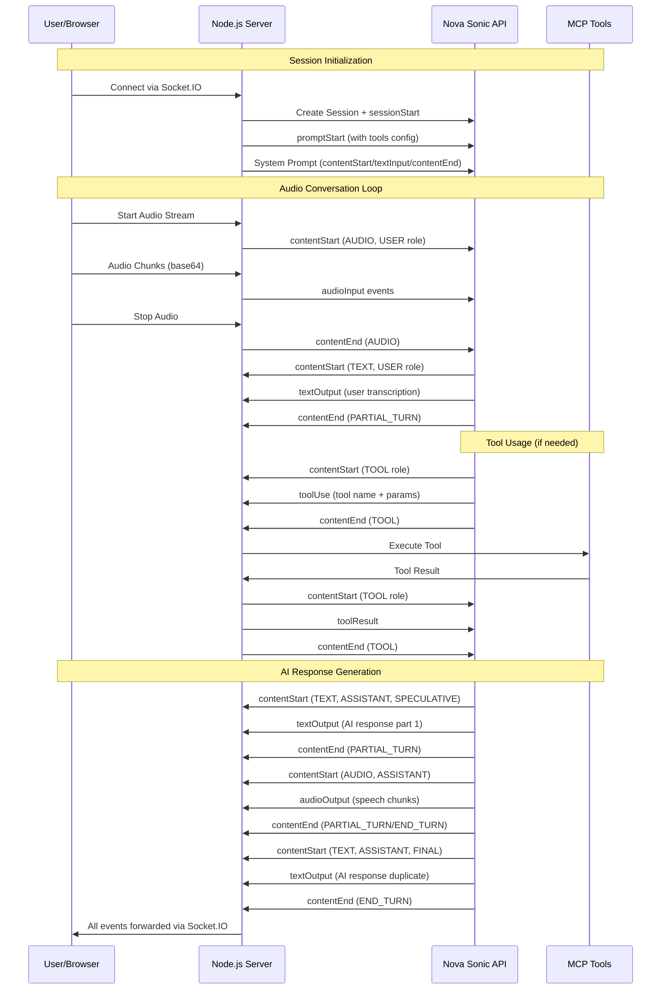

# 🚀 Nova Sonic Deep Dive Reference - Complete Technical Analysis

## 📋 Table of Contents

1. [Overview](#overview)
2. [Architecture & Flow](#architecture--flow)
3. [Event Types & Signatures](#event-types--signatures)
4. [Message Formats](#message-formats)
5. [Status Tags & Stop Reasons](#status-tags--stop-reasons)
6. [Session Management](#session-management)
7. [Audio Processing](#audio-processing)
8. [Tool Integration](#tool-integration)
9. [Error Handling](#error-handling)
10. [Client-Server Communication](#client-server-communication)
11. [State Management](#state-management)
12. [Configuration](#configuration)

---

## 🎯 Overview

Nova Sonic is AWS Bedrock's bidirectional streaming API for real-time voice conversations. This reference documents every detail of the conversation flow, message formats, status tags, and integration patterns discovered through deep analysis of the reference implementation.

### Key Components
- **AWS Bedrock Runtime Client**: Core streaming client
- **NovaSonicBidirectionalStreamClient**: Main client wrapper
- **StreamSession**: Session management layer
- **EventManager**: Event creation and handling
- **ToolHandler**: MCP tool integration
- **Socket.IO**: Real-time client-server communication

---

## 🏗️ Architecture & Flow

### Complete Conversation Flow



### Session Lifecycle States

```typescript
enum SessionState {
  INACTIVE = "inactive",
  INITIALIZING = "initializing", 
  PROMPT_READY = "prompt_ready",
  AUDIO_ACTIVE = "audio_active",
  PROCESSING = "processing",
  RESPONDING = "responding",
  CLOSING = "closing",
  CLOSED = "closed"
}
```

---

## 📡 Event Types & Signatures

### 1. Session Events

#### `sessionStart`
```typescript
interface SessionStartEvent {
  event: {
    sessionStart: {
      inferenceConfiguration: {
        maxTokens: number;
        topP: number;
        temperature: number;
      };
    };
  };
}
```

#### `sessionEnd`
```typescript
interface SessionEndEvent {
  event: {
    sessionEnd: {};
  };
}
```

### 2. Prompt Events

#### `promptStart`
```typescript
interface PromptStartEvent {
  event: {
    promptStart: {
      promptName: string; // UUID
      textOutputConfiguration: {
        mediaType: "text/plain";
      };
      audioOutputConfiguration: {
        audioType: "SPEECH";
        encoding: "base64";
        mediaType: "audio/lpcm";
        sampleRateHertz: 24000;
        sampleSizeBits: 16;
        channelCount: 1;
        voiceId: string; // e.g., "tiffany"
      };
      toolUseOutputConfiguration: {
        mediaType: "application/json";
      };
      toolConfiguration: {
        tools: ToolSpec[];
      };
    };
  };
}

interface ToolSpec {
  toolSpec: {
    name: string;
    description: string;
    inputSchema: {
      json: string; // JSON schema as string
    };
  };
}
```

#### `promptEnd`
```typescript
interface PromptEndEvent {
  event: {
    promptEnd: {
      promptName: string;
    };
  };
}
```

### 3. Content Events

#### `contentStart`
```typescript
interface ContentStartEvent {
  event: {
    contentStart: {
      promptName: string;
      contentName: string; // UUID
      type: "TEXT" | "AUDIO" | "TOOL";
      interactive: boolean;
      role: "USER" | "ASSISTANT" | "SYSTEM" | "TOOL";
      
      // For TEXT content
      textInputConfiguration?: {
        mediaType: "text/plain";
      };
      
      // For AUDIO content  
      audioInputConfiguration?: {
        audioType: "SPEECH";
        encoding: "base64";
        mediaType: "audio/lpcm";
        sampleRateHertz: 16000;
        sampleSizeBits: 16;
        channelCount: 1;
      };
      
      // For TOOL content
      toolResultInputConfiguration?: {
        toolUseId: string;
        type: "TEXT";
        textInputConfiguration: {
          mediaType: "text/plain";
        };
      };
      
      // Additional model fields (for responses)
      additionalModelFields?: string; // JSON string
    };
  };
}
```

#### `contentEnd`
```typescript
interface ContentEndEvent {
  event: {
    contentEnd: {
      promptName: string;
      contentName: string;
      stopReason?: "END_TURN" | "PARTIAL_TURN" | "INTERRUPTED" | "MAX_TOKENS";
      type?: "TEXT" | "AUDIO" | "TOOL";
    };
  };
}
```

### 4. Input Events

#### `textInput`
```typescript
interface TextInputEvent {
  event: {
    textInput: {
      promptName: string;
      contentName: string;
      content: string;
    };
  };
}
```

#### `audioInput`
```typescript
interface AudioInputEvent {
  event: {
    audioInput: {
      promptName: string;
      contentName: string;
      content: string; // base64 encoded audio
    };
  };
}
```

### 5. Output Events (from Nova Sonic)

#### `textOutput`
```typescript
interface TextOutputEvent {
  event: {
    textOutput: {
      completionId: string;
      content: string;
      contentId: string;
      promptName: string;
      role: "USER" | "ASSISTANT";
      sessionId: string;
    };
  };
}
```

#### `audioOutput`
```typescript
interface AudioOutputEvent {
  event: {
    audioOutput: {
      completionId: string;
      content: string; // base64 encoded audio
      contentId: string;
      promptName: string;
      sessionId: string;
    };
  };
}
```

### 6. Tool Events

#### `toolUse`
```typescript
interface ToolUseEvent {
  event: {
    toolUse: {
      completionId: string;
      contentId: string;
      promptName: string;
      sessionId: string;
      toolName: string;
      toolUseId: string;
      input: Record<string, any>; // Tool parameters
    };
  };
}
```

#### `toolResult`
```typescript
interface ToolResultEvent {
  event: {
    toolResult: {
      promptName: string;
      contentName: string;
      content: string; // Tool result as string
    };
  };
}
```

### 7. Usage Events

#### `usageEvent`
```typescript
interface UsageEvent {
  event: {
    usageEvent: {
      completionId: string;
      promptName: string;
      sessionId: string;
      totalTokens: number;
      inputTokens?: number;
      outputTokens?: number;
    };
  };
}
```

---

## 📋 Message Formats

### Client to Nova Sonic (Outbound)

#### Session Initialization
```json
{
  "event": {
    "sessionStart": {
      "inferenceConfiguration": {
        "maxTokens": 1024,
        "topP": 0.9,
        "temperature": 1
      }
    }
  }
}
```

#### System Prompt Setup
```json
[
  {
    "event": {
      "contentStart": {
        "promptName": "uuid-here",
        "contentName": "uuid-here",
        "type": "TEXT",
        "interactive": true,
        "role": "SYSTEM",
        "textInputConfiguration": {
          "mediaType": "text/plain"
        }
      }
    }
  },
  {
    "event": {
      "textInput": {
        "promptName": "uuid-here",
        "contentName": "uuid-here",
        "content": "You are a friend. The user and you will engage in a spoken dialog..."
      }
    }
  },
  {
    "event": {
      "contentEnd": {
        "promptName": "uuid-here",
        "contentName": "uuid-here"
      }
    }
  }
]
```

#### Audio Stream Start
```json
{
  "event": {
    "contentStart": {
      "promptName": "uuid-here",
      "contentName": "uuid-here",
      "type": "AUDIO",
      "interactive": true,
      "role": "USER",
      "audioInputConfiguration": {
        "audioType": "SPEECH",
        "encoding": "base64",
        "mediaType": "audio/lpcm",
        "sampleRateHertz": 16000,
        "sampleSizeBits": 16,
        "channelCount": 1
      }
    }
  }
}
```

#### Audio Data Chunk
```json
{
  "event": {
    "audioInput": {
      "promptName": "uuid-here",
      "contentName": "uuid-here",
      "content": "base64-encoded-audio-data"
    }
  }
}
```

### Nova Sonic to Client (Inbound)

#### User Speech Transcription
```json
{
  "event": {
    "contentStart": {
      "additionalModelFields": "{\"generationStage\":\"FINAL\"}",
      "completionId": "uuid-here",
      "contentId": "uuid-here",
      "promptName": "uuid-here",
      "role": "USER",
      "sessionId": "uuid-here",
      "textOutputConfiguration": {
        "mediaType": "text/plain"
      },
      "type": "TEXT"
    }
  }
}
```

```json
{
  "event": {
    "textOutput": {
      "completionId": "uuid-here",
      "content": "who is the chief minister of andhra pradesh",
      "contentId": "uuid-here",
      "promptName": "uuid-here",
      "role": "USER",
      "sessionId": "uuid-here"
    }
  }
}
```

#### AI Response (Speculative)
```json
{
  "event": {
    "contentStart": {
      "additionalModelFields": "{\"generationStage\":\"SPECULATIVE\"}",
      "completionId": "uuid-here",
      "contentId": "uuid-here",
      "promptName": "uuid-here",
      "role": "ASSISTANT",
      "sessionId": "uuid-here",
      "textOutputConfiguration": {
        "mediaType": "text/plain"
      },
      "type": "TEXT"
    }
  }
}
```

```json
{
  "event": {
    "textOutput": {
      "completionId": "uuid-here",
      "content": "I'm sorry, but I can't provide real-time information about the Chief Minister of Andhra Pradesh.",
      "contentId": "uuid-here",
      "promptName": "uuid-here",
      "role": "ASSISTANT",
      "sessionId": "uuid-here"
    }
  }
}
```

#### AI Response (Final - Duplicate)
```json
{
  "event": {
    "contentStart": {
      "additionalModelFields": "{\"generationStage\":\"FINAL\"}",
      "completionId": "uuid-here",
      "contentId": "uuid-here",
      "promptName": "uuid-here",
      "role": "ASSISTANT",
      "sessionId": "uuid-here",
      "textOutputConfiguration": {
        "mediaType": "text/plain"
      },
      "type": "TEXT"
    }
  }
}
```

#### Audio Response
```json
{
  "event": {
    "contentStart": {
      "audioOutputConfiguration": {
        "channelCount": 1,
        "encoding": "base64",
        "mediaType": "audio/lpcm",
        "sampleRateHertz": 24000,
        "sampleSizeBits": 16
      },
      "completionId": "uuid-here",
      "contentId": "uuid-here",
      "promptName": "uuid-here",
      "role": "ASSISTANT",
      "sessionId": "uuid-here",
      "type": "AUDIO"
    }
  }
}
```

```json
{
  "event": {
    "audioOutput": {
      "completionId": "uuid-here",
      "content": "base64-encoded-audio-response",
      "contentId": "uuid-here",
      "promptName": "uuid-here",
      "sessionId": "uuid-here"
    }
  }
}
```

#### Tool Usage
```json
{
  "event": {
    "contentStart": {
      "completionId": "uuid-here",
      "contentId": "uuid-here",
      "promptName": "uuid-here",
      "role": "TOOL",
      "sessionId": "uuid-here",
      "toolUseOutputConfiguration": {
        "mediaType": "application/json"
      },
      "type": "TOOL"
    }
  }
}
```

```json
{
  "event": {
    "toolUse": {
      "completionId": "uuid-here",
      "contentId": "uuid-here",
      "promptName": "uuid-here",
      "sessionId": "uuid-here",
      "toolName": "get_file_info",
      "toolUseId": "uuid-here",
      "input": {
        "path": "/some/file/path"
      }
    }
  }
}
```

---

## 🏷️ Status Tags & Stop Reasons

### Stop Reasons

| Stop Reason | Description | Context |
|-------------|-------------|---------|
| `END_TURN` | Complete turn finished | Final response completed |
| `PARTIAL_TURN` | Partial response | More content coming |
| `INTERRUPTED` | User interrupted | Barge-in detected |
| `MAX_TOKENS` | Token limit reached | Response truncated |

### Generation Stages

| Stage | Description | Usage |
|-------|-------------|-------|
| `SPECULATIVE` | Preliminary response | Displayed to user |
| `FINAL` | Final/duplicate response | Filtered out by reference app |

### Content Types

| Type | Description | Role Context |
|------|-------------|--------------|
| `TEXT` | Text content | USER, ASSISTANT, SYSTEM |
| `AUDIO` | Audio content | USER, ASSISTANT |
| `TOOL` | Tool usage/result | TOOL |

### Roles

| Role | Description | Usage |
|------|-------------|-------|
| `USER` | User input | Speech transcription |
| `ASSISTANT` | AI response | Generated responses |
| `SYSTEM` | System prompt | Initial setup |
| `TOOL` | Tool execution | MCP tool calls |

---

## 🎛️ Session Management

### Session Data Structure
```typescript
interface SessionData {
  queue: object[]; // Event queue
  queueSignal: Subject<void>; // RxJS signal for queue
  closeSignal: Subject<void>; // RxJS signal for close
  responseSubject: Subject<any>; // Response stream
  toolUseContent: any; // Current tool use data
  toolUseId: string; // Current tool use ID
  toolName: string; // Current tool name
  responseHandlers: Map<string, (data: any) => void>; // Event handlers
  promptName: string; // Session prompt UUID
  inferenceConfig: InferenceConfig; // AI config
  isActive: boolean; // Session state
  isPromptStartSent: boolean; // Prompt initialization flag
  isAudioContentStartSent: boolean; // Audio initialization flag
  audioContentId: string; // Audio content UUID
  toolHandler?: ToolHandler; // MCP tool handler
  userTimezone?: string; // User timezone
}
```

### Session Lifecycle Management
```typescript
class NovaSonicBidirectionalStreamClient {
  private activeSessions: Map<string, SessionData> = new Map();
  private sessionLastActivity: Map<string, number> = new Map();
  private sessionCleanupInProgress = new Set<string>();

  // Session creation
  createStreamSession(sessionId?: string): StreamSession;
  
  // Session initialization
  async initiateSession(sessionId: string): Promise<void>;
  
  // Session cleanup
  async closeSession(sessionId: string): Promise<void>;
  forceCloseSession(sessionId: string): void;
  
  // Activity tracking
  private updateSessionActivity(sessionId: string): void;
  getLastActivityTime(sessionId: string): number;
}
```

### Event Queue Management
```typescript
// Async iterable for streaming events to Nova Sonic
private createSessionAsyncIterable(sessionId: string): AsyncIterable<any> {
  return {
    [Symbol.asyncIterator]: () => ({
      next: async () => {
        // Wait for queue signal or close signal
        await Promise.race([
          firstValueFrom(session.queueSignal.pipe(take(1))),
          firstValueFrom(session.closeSignal.pipe(take(1)))
        ]);
        
        // Return next event from queue
        const nextEvent = session.queue.shift();
        return {
          value: {
            chunk: {
              bytes: new TextEncoder().encode(JSON.stringify(nextEvent))
            }
          },
          done: false
        };
      }
    })
  };
}
```

---

## 🎵 Audio Processing

### Audio Configuration
```typescript
// Input Configuration (from user)
const DefaultAudioInputConfiguration = {
  audioType: "SPEECH",
  encoding: "base64",
  mediaType: "audio/lpcm",
  sampleRateHertz: 16000,
  sampleSizeBits: 16,
  channelCount: 1
};

// Output Configuration (to user)
const DefaultAudioOutputConfiguration = {
  audioType: "SPEECH",
  encoding: "base64", 
  mediaType: "audio/lpcm",
  sampleRateHertz: 24000,
  sampleSizeBits: 16,
  channelCount: 1,
  voiceId: "tiffany" // Available: tiffany, etc.
};
```

### Audio Stream Processing
```typescript
class StreamSession {
  private audioBufferQueue: Buffer[] = [];
  private maxQueueSize = 200;
  private isProcessingAudio = false;

  async streamAudio(audioData: Buffer): Promise<void> {
    // Queue management
    if (this.audioBufferQueue.length >= this.maxQueueSize) {
      this.audioBufferQueue.shift(); // Drop oldest
    }
    
    this.audioBufferQueue.push(audioData);
    this.processAudioQueue();
  }

  private async processAudioQueue() {
    // Batch processing (max 5 chunks per batch)
    const maxChunksPerBatch = 5;
    let processedChunks = 0;
    
    while (this.audioBufferQueue.length > 0 && 
           processedChunks < maxChunksPerBatch) {
      const audioChunk = this.audioBufferQueue.shift();
      await this.client.streamAudioChunk(this.sessionId, audioChunk);
      processedChunks++;
    }
  }
}
```

### Client-Side Audio Processing
```typescript
// Audio Player using AudioWorklet
class AudioPlayer {
  private audioContext: AudioContext;
  private workletNode: AudioWorkletNode;
  
  async initialize() {
    this.audioContext = new AudioContext({ sampleRate: 24000 });
    await this.audioContext.audioWorklet.addModule('AudioPlayerProcessor.worklet.js');
    this.workletNode = new AudioWorkletNode(this.audioContext, 'audio-player-processor');
  }
  
  playAudio(base64Audio: string) {
    const audioData = atob(base64Audio);
    const buffer = new ArrayBuffer(audioData.length);
    const view = new Uint8Array(buffer);
    
    for (let i = 0; i < audioData.length; i++) {
      view[i] = audioData.charCodeAt(i);
    }
    
    // Send to worklet for playback
    this.workletNode.port.postMessage({
      type: 'audio',
      data: buffer
    });
  }
}
```

---

## 🛠️ Tool Integration

### Tool Configuration in promptStart
```typescript
const toolConfiguration = {
  tools: [
    // Built-in tools
    {
      toolSpec: {
        name: "getDateAndTimeTool",
        description: "Get current date and time information.",
        inputSchema: {
          json: JSON.stringify({
            type: "object",
            properties: {},
            required: []
          })
        }
      }
    },
    {
      toolSpec: {
        name: "getWeatherTool", 
        description: "Get current weather at specified location based on WGS84 coordinates.",
        inputSchema: {
          json: JSON.stringify({
            type: "object",
            properties: {
              latitude: {
                type: "string",
                description: "Geographical WGS84 latitude of the location."
              },
              longitude: {
                type: "string", 
                description: "Geographical WGS84 longitude of the location."
              }
            },
            required: ["latitude", "longitude"]
          })
        }
      }
    },
    // MCP tools dynamically added
    ...mcpToolSpecs
  ]
};
```

### Tool Execution Flow
```typescript
// 1. Nova Sonic sends toolUse event
{
  "event": {
    "toolUse": {
      "toolName": "get_file_info",
      "toolUseId": "uuid-here",
      "input": { "path": "/some/path" }
    }
  }
}

// 2. Server processes tool
async handleToolUse(sessionId: string, toolUse: any, session: SessionData) {
  session.toolUseContent = toolUse;
  session.toolUseId = toolUse.toolUseId;
  session.toolName = toolUse.toolName;
}

async handleToolEnd(sessionId: string, session: SessionData) {
  const toolResult = await this.toolHandler.processToolUse(
    session.toolName,
    session.toolUseContent,
    session.userTimezone
  );
  
  this.sendToolResult(sessionId, session.toolUseId, toolResult);
}

// 3. Server sends tool result back to Nova Sonic
[
  {
    "event": {
      "contentStart": {
        "type": "TOOL",
        "role": "TOOL",
        "toolResultInputConfiguration": {
          "toolUseId": "uuid-here",
          "type": "TEXT"
        }
      }
    }
  },
  {
    "event": {
      "toolResult": {
        "content": "tool-result-as-string"
      }
    }
  },
  {
    "event": {
      "contentEnd": {}
    }
  }
]
```

### MCP Tool Integration
```typescript
class McpManager {
  async initializeServers() {
    const config = await this.loadMcpConfig();
    
    for (const [serverName, serverConfig] of Object.entries(config.mcpServers)) {
      if (serverConfig.disabled) continue;
      
      const client = new Client({
        name: "nova-sonic-client",
        version: "1.0.0"
      }, {
        capabilities: {}
      });
      
      // Connect to MCP server
      await client.connect(transport);
      
      // Register tools
      const { tools } = await client.listTools();
      tools.forEach(tool => {
        this.toolHandler.registerMcpTool(
          tool.name,
          async (toolUseContent) => {
            const result = await client.callTool({
              name: tool.name,
              arguments: toolUseContent
            });
            return result;
          },
          serverName,
          tool.description
        );
      });
    }
  }
}
```

---

## ⚠️ Error Handling

### Error Types
```typescript
// Model stream errors
interface ModelStreamError {
  type: "modelStreamErrorException";
  details: any;
}

// Internal server errors  
interface InternalServerError {
  type: "internalServerException";
  details: any;
}

// Stream processing errors
interface StreamError {
  source: "responseStream" | "bidirectionalStream";
  message: string;
  details: string;
}
```

### Error Handling Implementation
```typescript
private async processResponseStream(sessionId: string, response: any) {
  try {
    for await (const event of response.body) {
      if (event.chunk?.bytes) {
        // Process normal events
      } else if (event.modelStreamErrorException) {
        this.handleModelError(sessionId, event.modelStreamErrorException);
      } else if (event.internalServerException) {
        this.handleServerError(sessionId, event.internalServerException);
      }
    }
  } catch (error) {
    this.handleStreamError(sessionId, error);
  }
}

private handleModelError(sessionId: string, error: any) {
  console.error(`Session ${sessionId} model stream error:`, error);
  this.dispatchEvent(sessionId, "error", {
    type: "modelStreamErrorException",
    details: error
  });
}
```

### Client-Side Error Handling
```typescript
socket.on("error", (data) => {
  console.error("Error received from server:", data);
  
  switch (data.type) {
    case "modelStreamErrorException":
      // Handle model errors
      showErrorMessage("AI service temporarily unavailable");
      break;
    case "internalServerException":
      // Handle server errors
      showErrorMessage("Server error occurred");
      break;
    default:
      showErrorMessage("An unexpected error occurred");
  }
});
```

---

## 🔄 Client-Server Communication

### Socket.IO Event Mapping
```typescript
// Server to Client Events
interface ServerToClientEvents {
  contentStart: (data: ContentStartEvent) => void;
  textOutput: (data: TextOutputEvent) => void;
  audioOutput: (data: AudioOutputEvent) => void;
  contentEnd: (data: ContentEndEvent) => void;
  toolUse: (data: ToolUseEvent) => void;
  toolResult: (data: any) => void;
  error: (data: ErrorEvent) => void;
  streamComplete: () => void;
}

// Client to Server Events  
interface ClientToServerEvents {
  startAudio: (config: AudioConfig) => void;
  audioData: (data: string) => void; // base64
  stopAudio: () => void;
  textMessage: (message: string) => void;
  setTimezone: (timezone: string) => void;
  setVoice: (voiceId: string) => void;
}
```

### Event Forwarding Pattern
```typescript
// Server forwards all Nova Sonic events to client
session.onEvent("contentStart", (data) => {
  console.log("contentStart:", data);
  socket.emit("contentStart", data);
});

session.onEvent("textOutput", (data) => {
  console.log("Text output:", data);
  socket.emit("textOutput", data);
});

session.onEvent("audioOutput", (data) => {
  socket.emit("audioOutput", data);
});

session.onEvent("contentEnd", (data) => {
  console.log("Content end received:", data);
  socket.emit("contentEnd", data);
});
```

### Client Event Handling
```typescript
// Content start handling with role and stage detection
socket.on("contentStart", (data) => {
  if (data.type === "TEXT") {
    role = data.role; // Set global role
    
    if (data.role === "ASSISTANT") {
      // Parse generation stage
      if (data.additionalModelFields) {
        const fields = JSON.parse(data.additionalModelFields);
        const isSpeculative = fields.generationStage === "SPECULATIVE";
        displayAssistantText = isSpeculative; // Only show SPECULATIVE
      }
    }
  }
});

// Text output filtering based on role and display flag
socket.on("textOutput", (data) => {
  if (role === "USER") {
    // Always process user text
    handleTextOutput({
      role: data.role,
      content: data.content
    });
  } else if (role === "ASSISTANT" && displayAssistantText) {
    // Only process SPECULATIVE assistant text
    handleTextOutput({
      role: data.role,
      content: data.content
    });
  }
});
```

---

## 🎮 State Management

### Global State Variables
```typescript
// Client-side state management
let role: "USER" | "ASSISTANT"; // Current content role
let displayAssistantText: boolean = false; // SPECULATIVE filter flag
let isStreaming: boolean = false; // Audio streaming state
let transcriptionReceived: boolean = false; // User speech detected
let waitingForAssistantResponse: boolean = false; // Response pending
let sessionInitialized: boolean = false; // Session ready
```

### State Transitions
```typescript
// Audio streaming states
enum AudioState {
  IDLE = "idle",
  RECORDING = "recording", 
  PROCESSING = "processing",
  PLAYING = "playing"
}

// UI states
enum UIState {
  READY = "ready",
  LISTENING = "listening",
  THINKING = "thinking",
  SPEAKING = "speaking",
  ERROR = "error"
}
```

### State Management Patterns
```typescript
// Role-based state management
socket.on("contentStart", (data) => {
  if (data.type === "TEXT") {
    role = data.role; // Update global role
    
    // State-specific UI updates
    if (data.role === "USER") {
      hideUserThinkingIndicator();
    } else if (data.role === "ASSISTANT") {
      hideAssistantThinkingIndicator();
      
      // Generation stage filtering
      const fields = JSON.parse(data.additionalModelFields || "{}");
      displayAssistantText = fields.generationStage === "SPECULATIVE";
    }
  }
});

// Content end state transitions
socket.on("contentEnd", (data) => {
  if (data.type === "TEXT") {
    if (role === "USER") {
      showAssistantThinkingIndicator(); // Wait for AI
    } else if (role === "ASSISTANT") {
      hideAssistantThinkingIndicator(); // AI done
    }
    
    // Handle turn completion
    if (data.stopReason === "END_TURN") {
      chatHistoryManager.endTurn();
    }
  }
});
```

---

## ⚙️ Configuration

### Inference Configuration
```typescript
interface InferenceConfig {
  maxTokens: number; // Default: 1024
  topP: number; // Default: 0.9
  temperature: number; // Default: 1.0
}
```

### Audio Configuration
```typescript
// Input (User to Nova Sonic)
interface AudioInputConfig {
  audioType: "SPEECH";
  encoding: "base64";
  mediaType: "audio/lpcm";
  sampleRateHertz: 16000; // 16kHz input
  sampleSizeBits: 16;
  channelCount: 1;
}

// Output (Nova Sonic to User)
interface AudioOutputConfig {
  audioType: "SPEECH";
  encoding: "base64";
  mediaType: "audio/lpcm";
  sampleRateHertz: 24000; // 24kHz output
  sampleSizeBits: 16;
  channelCount: 1;
  voiceId: string; // "tiffany", etc.
}
```

### System Prompt Configuration
```typescript
const DefaultSystemPrompt = 
  "You are a friend. The user and you will engage in a spoken " +
  "dialog exchanging the transcripts of a natural real-time conversation. " +
  "Keep your responses short, generally two or three sentences for chatty scenarios.";
```

### HTTP/2 Configuration
```typescript
const nodeHttp2Handler = new NodeHttp2Handler({
  requestTimeout: 300000, // 5 minutes
  sessionTimeout: 600000, // 10 minutes
  disableConcurrentStreams: false,
  maxConcurrentStreams: 20
});
```

### CORS Configuration
```typescript
const corsOptions = {
  origin: "http://localhost:3001",
  credentials: true,
  methods: ["GET", "POST", "PUT", "DELETE", "OPTIONS"],
  allowedHeaders: [
    "Content-Type",
    "Authorization", 
    "X-Requested-With",
    "Accept",
    "Origin"
  ]
};
```

---

## 🔍 Key Insights & Patterns

### 1. Duplication Handling
- **SPECULATIVE** content is shown to users immediately
- **FINAL** content contains duplicates and is filtered out
- Reference app uses `displayAssistantText` flag for filtering

### 2. Event Sequencing
- Events follow strict order: `contentStart` → content events → `contentEnd`
- Multiple `PARTIAL_TURN` events can occur before `END_TURN`
- Tool usage interrupts normal text/audio flow

### 3. Session Management
- Sessions use UUID-based identification
- Event queues use RxJS Subjects for async coordination
- Cleanup requires proper sequence: contentEnd → promptEnd → sessionEnd

### 4. Audio Processing
- Input: 16kHz PCM, Output: 24kHz PCM
- Base64 encoding for all audio data
- Chunked processing with queue management

### 5. Tool Integration
- Tools configured in `promptStart` event
- MCP tools dynamically registered
- Tool results sent as separate content blocks

### 6. Error Recovery
- Multiple error types with specific handling
- Session cleanup on errors
- Graceful degradation patterns

---

## 📊 Performance Considerations

### 1. Audio Buffering
- Maximum queue size: 200 chunks
- Batch processing: 5 chunks per batch
- Drop oldest chunks when queue full

### 2. Session Limits
- Maximum concurrent streams: 20
- Session timeout: 10 minutes
- Request timeout: 5 minutes

### 3. Memory Management
- Event queues cleared on session close
- RxJS subjects properly completed
- Buffer cleanup in audio processing

### 4. Network Optimization
- HTTP/2 for efficient streaming
- Base64 encoding for binary data
- Chunked audio transmission

---

## 🎯 Best Practices

### 1. Session Management
- Always check session active state
- Implement proper cleanup sequences
- Handle abrupt disconnections gracefully

### 2. Audio Processing
- Use AudioWorklet for real-time playback
- Implement proper buffering strategies
- Handle audio underflow/overflow

### 3. Error Handling
- Implement retry mechanisms
- Provide user-friendly error messages
- Log detailed error information

### 4. State Management
- Use role-based state transitions
- Implement proper UI state indicators
- Handle concurrent state changes

### 5. Tool Integration
- Validate tool schemas
- Handle tool execution timeouts
- Implement proper error responses

---

## 🔗 References

- **AWS Bedrock Runtime API**: Bidirectional streaming documentation
- **Nova Sonic Model**: amazon.nova-sonic-v1:0
- **MCP Protocol**: Model Context Protocol specification
- **Socket.IO**: Real-time communication library
- **RxJS**: Reactive programming for event handling

---

*This document represents the most comprehensive analysis of Nova Sonic integration patterns, capturing every detail discovered through deep examination of the reference implementation.*
